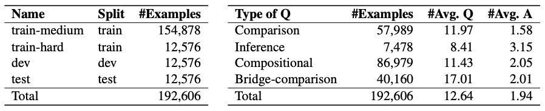
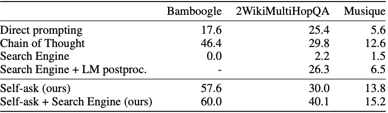

## Proposed Roadmap
**I tag my recommendations with _recommended_ and other possibilities we can get to if we have time with _optional_.**

---

It is common to fine-tune pre-trained LLMs on a specific domain, such as medicine, law, or a company's internal documents. In this fine-tuning, the LLM absorbs facts. However, it has been shown that LLMs are quite bad at composing facts (i.e. creating logical chains of facts) to derive new facts, which is crucial step for LLMs to solve more complicated problems. If the question requires composing multiple pieces of information (i.e. multi-hop reasoning), then many systems will "hallucinate" and give nonsensical responses. 

Even when the model answers the sub-questions correctly, it still struggles to answer the overall question correctly, as this requires compositional reasoning. This has been dubbed the "compositionality gap," and this [paper](https://ofir.io/self-ask.pdf) shows that simply scaling model size has little effect on narrowing this compositionality gap. The authors also show we can obtain performance gains by adding examples/instructions to the prompt to break a multi-hop question into sub-questions, answer the sub-questions, and then compose the sub-answers to reach a final answer. This prompting strategy is called self-ask, and it outperforms the previous SOTA elicitive prompting, Chain of Thought Reasoning.

Our goal is to improve on self-ask by fine-tuning with self-ask annotations (inserting self-ask examplars in the training prompts) and/or fine-tuning with self-ask targets (inserting a self-ask rationale as the 'target text' in each example). The original paper did not do fine-tuning, it only used self-ask prompts.

The motivation for this angle is the results from the [FLAN paper](https://arxiv.org/pdf/2210.11416.pdf) by Google, which fine-tuned on CoT annotations and showed better multi-hop reasoning abilities after the fact. Given CoT has been replaced by self-ask as SOTA for compositional reasoning, we are interested if this fine-tuning approach on self-ask annotation will yield even greater results in zero-shot, one-shot, and few-shot regimes.

While the FLAN paper focuses on a variety of tasks, we will focus on compositional reasoning QA.
> "Compositional reasoning lets models go beyond rote memorization of directly observed facts to deduce previously unseen knowledge."

The experimental setup I propose is:
1. Baselines: Direct prompting, CoT with 4 examplars
2. Benchmark: Self-ask with 4 examplars
3. Our approaches (4 possible fine-tuning configurations, raw refers to original text, annotated refers to original text augmented with self-ask rationale)
   1. Fine-tuned on raw questions to generate raw answers (*optional*)
   2. Fine-tuned on self-ask annotated questions to generate raw answer (*recommended*)
   3. Fine-tuned on raw questions to generate self-ask annotated answer (*optional*)
   4. Fine-tuned on self-ask annotated questions to generate self-ask annotated answer (*recommended*)

The possible evaluation criteria are:
1. Accuracy on compositional reasoning QA datasets (few-shot, zero-shot for fine-tuned models), *recommended*
2. Compositionality gap (few-shot self-ask versus few-shot fine-tuned versus zero-shot fine-tuned), *optional, the original paper already shows elimination of compositionality gap, not sure if there is much to improve on here except if we can eliminate compositionality gap in even smaller models.*
3. Zero-shot self-ask rationale generation (fine-tuned approaches only). This looks at what fraction of generated outputs actually invokes the self-ask rationale (as opposed to just answering the question). Would be interesting to see differences here between the different fine-tuning configurations, *optional*

Fine-tuning procedure:
- **Train**: Randomly sample X examples from compositional celebrities and combine with train set from 2WikiMultiHop datasets, augmented using `DataAdaptor` class ([here](/data_adaptor.py)). Open question: how is loss computed for QA dataset, especially if model generates rationale + answer?
- **Dev**: Randomly sample Y examples from compositional celebrities and combine with dev set from 2WikiMultiHop datasets, augmented using `DataAdaptor` class ([here](/data_adaptor.py))
- **Test**: Add leftover examples from compositional celebrities dataset with test set from 2WikiMultiHop. Add Bamboogle dataset as test (*recommended*) and Musique as test (*optional*).

Model choice (undecided):
- Decision between T5 family and GPT-3 family
- GPT-3
  - Pros: easy comparison to Press paper, known to have been trained on wikipedia, powerful models (up to 175B parameters)
  - Cons: can only fine-tune GPT-3, not InstructGPT-3, costs money
- T5
  - Pros: access to fine-tune both T5 and instruction-tuned T5 (FLAN), free
  - Cons: not as powerful (up to 11B parameters), inputs require task-specific prefix, uncertainty if these models have been trained on wikipedia, cannot compare to Press paper results (will need to replicate entire paper on T5 for a comparison)

## Appendix
### Datasets
> "Compositional Celebrities is designed to estimate the compositionality gap on a large set of questions, and Bamboogle is designed to measure the extent to which a question answering system can answer varied compositional questions, albeit with less statistical power." - Press, et al.

> "Musique, 2WikiMultiHop and CC are large, automatically generated datasets with questions that *conform to a small number of templates*. We manually constructed Bamboogle, a dataset of 125 questions, by reading random Wikipedia articles and writing a 2-hop question about them, leading to a varied dataset that challenges a system’s ability to decompose complex questions."

- 2WikiMultihopQA - "We carefully design a pipeline
and a set of templates when generating a question–answer pair that guarantees the multi-hop steps and the quality of the questions. We also exploit the structured format in Wikidata and use logical rules to create questions that are natural but still require multi-hop reasoning. Through experiments, we demonstrate that our dataset is challenging for multi-hop models and it ensures that multi-hop reasoning is required." - Ho, et al.

  - [File](https://www.dropbox.com/s/npidmtadreo6df2/data.zip)
  - [Repo](https://github.com/Alab-NII/2wikimultihop)
  - [Paper](https://aclanthology.org/2020.coling-main.580/)
- Musique - "a new multihop QA dataset with 25K 2–4 hop questions. Relative to existing datasets, MuSiQue-Ans is more difficult overall (3× increase in human–machine gap), and harder to cheat via disconnected reasoning... We begin with a large set of RC singlehop questions from 5 English Wikipedia-based datasets." - Trivedi, et al.
  - **Size (2-hop)**: train: 14,376; dev: 1,252; test: 1,271
  - [File](https://drive.google.com/file/d/1tGdADlNjWFaHLeZZGShh2IRcpO6Lv24h/view)
  - [Repo](https://github.com/stonybrooknlp/musique)
  - [Paper](https://aclanthology.org/2022.tacl-1.31/)
- Compositional Celebrities - "large, automatically generated dataset where each question fits into one of the 17 templates we made (i.e., much lower variation than Bamboogle)"
  - **Size**: test: 8,693
  - [File](https://github.com/ofirpress/self-ask/blob/main/datasets/compositional_celebrities.json)
  - [Repo](https://github.com/ofirpress/self-ask/blob/main/datasets/README.md)
  - [Paper](https://ofir.io/self-ask.pdf)
- Bamboogle - "a small dataset with 2-hop questions written by the authors... a small, hand- crafted dataset that covers many different types of questions on different areas written in unique ways... As opposed to [other datasets], Bamboogle questions are almost all independent of one another. We therefore consider it a fitting complement to the other datasets for measuring LM compositional abilities."
  - **Size**: test: 125
  - [File](https://docs.google.com/spreadsheets/d/1jwcsA5kE4TObr9YHn9Gc-wQHYjTbLhDGx6tmIzMhl_U/edit#gid=0)
  - [Repo](https://github.com/ofirpress/self-ask/blob/main/datasets/README.md)
  - [Paper](https://ofir.io/self-ask.pdf)

### Models
The key task is compositional reasoning. We want the LLM to answer a question that is not explicitly known on the internet, but can be derived by facts that the LLM should "know" (seen in training data). Since the datasets are constructed using known facts from Wikipedia, *the chosen model must have been trained on Wikipedia, otherwise it will not know the necessary facts to answer the compositional question.*

#### GPT
There are the GPT-3 family of models (not instruction-tuned), and then the InstructGPT-3 models (instruction-tuned).
- GPT-3: ada, babbage, curie, davinci
- InstructGPT-3: text-ada-002, text-babbage-002, text-curie-002, text-davinci-002

> "Currently, you can only fine-tune base GPT-3 models (davinci, curie, babbage, and ada)." - [OpenAI](https://platform.openai.com/docs/guides/gpt/is-fine-tuning-available-for-the-latest-models)

Press et al. use both, and only report text-davinci-002 for compositional QA accuracy experiments. But this model is currently unavailable to fine-tune.

For fine-tuning the base GPT-3 models, we can follow this [guide](https://platform.openai.com/docs/guides/fine-tuning).


#### T5
Similar to GPT, there are two T5 family of models: 1) T5 (not instruction-tuned); 2) FLAN-T5 (instruction-tuned, released in [paper](https://arxiv.org/pdf/2210.11416.pdf)).
- [T5](https://huggingface.co/docs/transformers/main/model_doc/t5): t5-small, t5-base, t5-large, t5-3b, t5-11b
- [FLAN-T5](https://huggingface.co/docs/transformers/main/model_doc/flan-t5): flan-t5-small, flan-t5-base, flan-t5-large, flan-t5-xl, flan-t5-xxl

The only problem is it is not clear if T5 has seen wikipedia in the training data.

Resources:
- Tutorial on fine-tuning [FLAN-T5](https://www.philschmid.de/fine-tune-flan-t5)

#### Alpaca
The 7B parameter Alpaca model is reported to behave similarily for the InstructGPT davinci model (175B), so since we can't finetune text-davinci, perhaps we use this model as a proxy?
> "The current Alpaca model is fine-tuned from a 7B LLaMA model on 52K instruction-following data generated by the techniques in the Self-Instruct paper... In a preliminary human evaluation, *we found that the Alpaca 7B model behaves similarly to the text-davinci-003 model* on the Self-Instruct instruction-following evaluation suite"

The only problem is it is not obvious how we actually fine-tune this model. The documentation is poor.

### Approach
There are two metrics measured in the original paper:
1. Compositionality Gap: "the fraction of questions for which the model correctly answers individual sub-questions but not the compositional question"
2. Accuracy: accuracy on three QA datasets

Use the idea of annotation fine-tuning from the [FLAN paper](https://arxiv.org/pdf/2210.11416.pdf)


#### Improve Compositional Reasoning using QA Fine-Tuning with In-Context Examples
The motivation is to apply the self-ask method, which is shown to outperform COT, with the fine-tuning approach in the FLAN paper by Google:
> "The goal of Flan finetuning is to produce an improved checkpoint across a range of evaluations, which includes multi-step reasoning ability in addition to traditional NLP tasks. In this section we explore the effect of including chain-of-thought (CoT) data in the instruction finetuning mixture. First, we show that the improved reasoning abilities of Flan-PaLM surpass prior models on several benchmarks. Then, we ablate CoT finetuning data and show that whereas instruction finetuning without CoT actually degrades reasoning ability, including just nine CoT datasets improves performance on all evaluations. Finally, we show that CoT finetuning unlocks zero-shot reasoning via "let's think step-by-step" on challenging BIG-Bench tasks."



We have the above results for Davinci-002 on three datasets, reported by Ofir Press. These results measure accuracy on compositional reasoning QA datasets. There is no information captured on whether the model answers sub-questions or intermediate hops correctly. This is simply an overall QA performance experiment. The authors experiment with different prompting strategies, but there is no fine-tuning involved.

Our approach could be to repeat this experiment, but additionally fine-tune a model on a compositional reasoning dataset *with added in-context examples*.

Let's say we have one examplar (authors used 4).
```
Question: Are director of film Move (1970 Film) and director of film Méditerranée (1963 Film) from the same country?
Are follow up questions needed here: Yes.
Follow up: Who is the director of Move (1970 film)?
Intermediate answer: Stuart Rosenberg.
Follow up: Who is the director of Méditerranée (1963 film)?
Intermediate answer: Jean-Daniel Pollet
Follow up: What is the country of citizenship of Stuart Rosenberg?
Intermediate answer: American
Follow up: What is the country of citizenship of Jean-Daniel Pollet?
Intermediate answer: French
So the final answer is: no
```

Every (question, answer) pair in the dataset would be modified to (question+examplars, answer).

So, let's say we have the pair:
```
Question: Do both films The Falcon (Film) and Valentin The Good have the directors from the same country?
```
```
no
```

The *new* training example would become:
```
Question: Are director of film Move (1970 Film) and director of film Méditerranée (1963 Film) from the same country?
Are follow up questions needed here: Yes.
Follow up: Who is the director of Move (1970 film)?
Intermediate answer: Stuart Rosenberg.
Follow up: Who is the director of Méditerranée (1963 film)?
Intermediate answer: Jean-Daniel Pollet
Follow up: What is the country of citizenship of Stuart Rosenberg?
Intermediate answer: American
Follow up: What is the country of citizenship of Jean-Daniel Pollet?
Intermediate answer: French
So the final answer is: no

Question: Do both films The Falcon (Film) and Valentin The Good have the directors from the same country?
```
```
no
```

The hypothesis is that the language model will be better at answering the question when it engages in "self-ask" in its generated output. In this setup, we are not testing if it actually uses "self-ask" (although we should definitely measure that). We are simply nudging the model to use this "self-ask rationale" by providing examples in the input test of how we want it to approach the reasoning question.

Steps:
1. Augment inputs of dataset with in-context examples
2. Fine-tune on augmented train dataset using cross entropy (what probability is assigned to the correct label by the model).

The evaluation would cover zero-shot, one-shot, and few-shot regions.
- For zero-shot, has the model learned to instinctively rely on "self-ask" in answering reasoning questions?
- For one-shot, is the model better at answering questions compared to strictly in-context learning (no fine-tuning)? Is it more likely to follow the self-ask protocol?
- For few-shot, is the model outperforming the reported results in Ofir Press paper?

#### Improving the Compositionality Gap using Fine-Tuning with In-Context Examples
> "We refer to the fraction of questions for which the model correctly answers individual sub-questions but not the compositional question as the compositionality gap." - Press, et al.

To measure the compositionality gap, we also need to measure whether the model answers sub-questions correctly. This means the dataset must define a higher-level, compositional (question, answer) pair, but also the intermediate (subquestion, answer) pairs. This only exists in the Compositional Celebrities (CC) dataset, created by the authors.

> "CC, which we design to measure the compositionality gap, intentionally contains direct and unambiguous questions, where (1) each fact has likely appeared many times in the training dataset, but (2) the combination of both facts is sufficiently unnatural that it likely never appeared in the training
set or on the internet at all." - Press, et al.

The approach here would be:
1. Augment the 2WikiMultihopQA dataset: (question, answer) -> (question+examples, answer)
2. Fine-tune on augmented 2WikiMultihopQA dataset
3. Measure compositionality gap using Compositional Celebrities
4. Compare results to Press, et al.

The key research question is, "does fine-tuning GPT3 with self-ask rationales narrow the compositionality gap even further over self-ask prompts?"

#### Improve Compositional Reasoning using Text Generation Fine-Tuning with In-Context Examples
Very similar to the first approach, except we modify the task slightly. Rather than assessing correctness of the answer (is the model right or wrong), we pivot to a text generation task where we actually include the self-ask rationale in the expected output and measure how well the LLM is able to match this output. So we penalize the model if it does not generate the self-ask rationale, not necessarily if it answers the question correctly. It's also possible we investigate multi-task learning, where we have a loss function for both text generation and QA correctness.

We can use either Compositional Celebrities dataset or 2WikiMultihopQA dataset for fine-tuning, where we do some text preprocessing on the questions and answers. It should be easy to automate. The code for this is in [this file](/data_adaptor.py), and the demo of it in action on the actual data is [here](/data_exploration.ipynb).

The final evaluation would be on holdout sets to see how well QA performance increases relative to the results reported in Press, et al.
